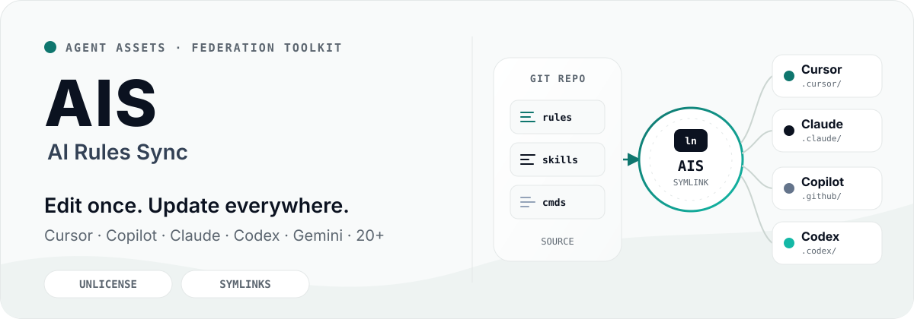

# AI Rules Sync

<p align="center">
  
</p>

<p align="center">
  <a href="https://www.npmjs.com/package/ai-rules-sync"></a>
  <a href="https://github.com/lbb00/ai-rules-sync/blob/master/LICENSE"></a>
  <a href="https://www.npmjs.com/package/ai-rules-sync"></a>
</p>

<p align="center">
  <a href="./README.md">English</a> ·
  <a href="./README_ZH.md">中文</a> ·
  <a href="https://lbb00.github.io/ai-rules-sync/"><strong>Documentation</strong></a>
</p>

**AI Rules Sync (AIS)** — Install, compose, update, and publish native agent assets from multiple Git repositories across all your projects.

> **AIS is an asset federation toolkit, not a format converter.** It keeps your files exactly as they are — skills, rules, commands, agents — and syncs them via symbolic links. Edit once, update everywhere.

---

## Why AIS

| AIS | Other tools |
|---|---|
| **Symlinks** — upstream changes are instant | Copy files — must re-run to update |
| **Many repos → many projects** — compose and remap per project | One project at a time |
| **Native assets** — no format conversion | Rewrite / re-generate your files |
| **Import → publish → review** workflow | One-way consumption only |
| **370 KB, 5 dependencies** | Often 10+ MB with deep dependency trees |
| **Git-native** — works with any Git remote | Tied to specific registries or APIs |

AIS is complementary to format-conversion tools. Use AIS to manage and sync native assets; use another tool if you need to rewrite formats.

---

## Installation

```bash
npm install -g ai-rules-sync
```

macOS via Homebrew:

```bash
brew tap lbb00/ai-rules-sync https://github.com/lbb00/ai-rules-sync
brew install ais
```

```bash
ais --version
ais completion install    # optional tab completion
```

---

## Quick Start

**Use assets from a repository**

```bash
cd your-project
ais cursor add react -t https://github.com/your-org/rules-repo.git

# After the first add, omit -t
ais cursor add vue
ais copilot instructions add coding-standards
ais claude skills add code-review
```

**Share existing assets**

```bash
ais cursor rules import my-custom-rule
ais cursor rules import my-rule --push
```

**Restore for teammates / CI**

```bash
ais install    # reads ai-rules-sync.json
```

**Personal configs (`--user`)**

```bash
ais claude md add CLAUDE --user
ais gemini md add GEMINI --user
ais user install    # new machine
```

---

## How it works

1. **Clone** — repositories land in `~/.config/ai-rules-sync/repos/`
2. **Compose** — each project picks repos from the cache and remaps directories
3. **Symlink** — projects link into the cache; they do not copy files
4. **Update** — `git pull` in the cache updates every linked project

| File | Scope | Committed |
|------|-------|-----------|
| `ai-rules-sync.json` | Shared, per-project | Yes |
| `ai-rules-sync.local.json` | Private, per-project | No |
| `user.json` (`~/.config/ai-rules-sync/`) | Personal, per-machine | Optional (dotfiles) |

| Command | Role |
|---------|------|
| `ais add` | Link an asset from a repository into this project |
| `ais import` | Copy an asset into the repository, then replace it with a symlink |
| `ais install` | Recreate all symlinks from `ai-rules-sync.json` |

Full command list, config schema, and per-tool guides: **[Documentation](https://lbb00.github.io/ai-rules-sync/)**.

---

## Supported Tools

_This table is generated from `docs/supported-tools.json` via `npm run docs:sync-tools`._

<!-- SUPPORTED_TOOLS_TABLE:START -->
| Tool | rules | skills | commands | agents | AGENTS.md | tools | prompts | instructions |
|:---|:---:|:---:|:---:|:---:|:---:|:---:|:---:|:---:|
| **Universal** | — | — | — | — | ✅ | — | — | — |
| Aider | — | ✅ | — | — | — | — | — | — |
| Amp | — | ✅ | — | — | — | — | — | — |
| Antigravity CLI | — | ✅ | ✅ | — | — | — | — | — |
| Augment Code | ✅ | ✅ | ✅ | ✅ | — | — | — | — |
| Claude Code | ✅ | ✅ | — | ✅ | ✅ | — | — | — |
| Cline | ✅ | ✅ | ✅ | ✅ | — | — | — | — |
| CodeBuddy | ✅ | ✅ | ✅ | — | ✅ | — | — | — |
| Codex | ✅ | ✅ | — | ✅ | ✅ | — | — | — |
| Continue | ✅ | ✅ | — | — | — | — | ✅ | — |
| Cursor | ✅ | ✅ | ✅ | ✅ | — | — | — | — |
| DeepAgents | — | ✅ | — | ✅ | ✅ | — | — | — |
| DeepSeek | — | ✅ | — | — | ✅ | — | — | — |
| Factory Droid | — | ✅ | ✅ | ✅ | ✅ | — | — | — |
| Gemini CLI | — | ✅ | ✅ | ✅ | ✅ | — | — | — |
| GitHub Copilot | — | ✅ | — | ✅ | — | — | ✅ | ✅ |
| Goose | — | ✅ | — | — | — | — | — | — |
| Hermes Agent | ✅ | ✅ | — | — | — | — | — | — |
| Junie | ✅ | ✅ | ✅ | ✅ | ✅ | — | — | — |
| Kilo Code | — | ✅ | ✅ | ✅ | ✅ | — | — | — |
| Kimi Code | — | ✅ | — | ✅ | ✅ | — | — | — |
| Kiro | ✅ | ✅ | — | ✅ | — | — | — | — |
| OpenCode | ✅ | ✅ | ✅ | ✅ | — | ✅ | — | — |
| Pi | — | ✅ | — | — | ✅ | — | ✅ | — |
| Qwen Code | ✅ | ✅ | ✅ | ✅ | ✅ | — | — | — |
| Trae | ✅ | ✅ | ✅ | ✅ | — | — | — | — |
| Warp | ✅ | ✅ | — | — | — | — | — | — |
| Windsurf | ✅ | ✅ | ✅ | — | — | — | — | — |
| WorkBuddy | — | ✅ | — | — | — | — | — | — |
| Zed | — | ✅ | — | — | — | — | — | — |
<!-- SUPPORTED_TOOLS_TABLE:END -->

[Directory reference](./docs/reference/supported-tools.md) — source paths, modes, suffixes, and docs links. User mode (`--user`) syncs personal configs into `$HOME`.

---

## Learn more

- [Getting Started](https://lbb00.github.io/ai-rules-sync/guide/getting-started)
- [Core Concepts](https://lbb00.github.io/ai-rules-sync/guide/core-concepts)
- [Multiple Repositories](https://lbb00.github.io/ai-rules-sync/guide/multiple-repos)
- [CLI Reference](https://lbb00.github.io/ai-rules-sync/reference/cli)
- [Configuration](https://lbb00.github.io/ai-rules-sync/reference/configuration)
- [Issues](https://github.com/lbb00/ai-rules-sync/issues) · [npm](https://www.npmjs.com/package/ai-rules-sync)

## License

[Unlicense](./LICENSE)
