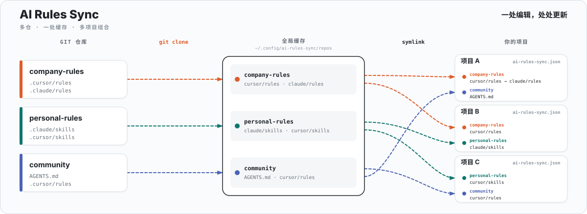

# AI Rules Sync

<p align="center">
  
</p>

<p align="center">
  <a href="https://www.npmjs.com/package/ai-rules-sync"></a>
  <a href="https://github.com/lbb00/ai-rules-sync/blob/master/LICENSE"></a>
  <a href="https://www.npmjs.com/package/ai-rules-sync"></a>
</p>

<p align="center">
  <a href="./README.md">English</a> ·
  <a href="./README_ZH.md">中文</a> ·
  <a href="https://lbb00.github.io/ai-rules-sync/zh/"><strong>文档</strong></a>
</p>

**AI Rules Sync (AIS)** — 从多个 Git 仓库安装、组合、更新和发布原生 Agent 资产，同步到所有项目。

> **AIS 是资产联邦工具，不是格式转换器。** 文件保持原样 — skills、rules、commands、agents — 通过软链接同步。一处编辑，处处更新。

---

## 为什么是 AIS

| AIS | 其他工具 |
|---|---|
| **软链接** — 上游改动即时生效 | 复制文件 — 需要重新运行才能更新 |
| **多仓 → 多项目** — 每个项目按需组合并映射目录 | 一次只能处理一个项目 |
| **原生资产** — 不做格式转换 | 重写 / 重新生成你的文件 |
| **导入 → 发布 → 审核** 协作流程 | 只能单向消费 |
| **370 KB，5 个依赖** | 通常 10+ MB 及深层依赖树 |
| **Git 原生** — 兼容任何 Git remote | 绑定特定 registry 或 API |

AIS 与格式转换工具互补：用 AIS 管理和同步原生资产；需要改写格式时再用别的工具。

---

## 安装

```bash
npm install -g ai-rules-sync
```

macOS 可用 Homebrew：

```bash
brew tap lbb00/ai-rules-sync https://github.com/lbb00/ai-rules-sync
brew install ais
```

```bash
ais --version
ais completion install    # 可选：Tab 补全
```

---

## 快速开始

**使用仓库中的资产**

```bash
cd your-project
ais cursor add react -t https://github.com/your-org/rules-repo.git

# 第一次之后可以省略 -t
ais cursor add vue
ais copilot instructions add coding-standards
ais claude skills add code-review
```

**分享现有资产**

```bash
ais cursor rules import my-custom-rule
ais cursor rules import my-rule --push
```

**团队入职 / CI 恢复**

```bash
ais install    # 读取 ai-rules-sync.json
```

**个人配置（`--user`）**

```bash
ais claude md add CLAUDE --user
ais gemini md add GEMINI --user
ais user install    # 新机器
```

---

## 工作原理

1. **克隆** — 仓库进入 `~/.config/ai-rules-sync/repos/`
2. **组合** — 每个项目从缓存里挑仓，并按需映射目录
3. **软链接** — 项目链接到缓存，不复制文件
4. **更新** — 缓存里 `git pull` 后，所有已链接项目立刻生效

| 文件 | 作用域 | 提交到 Git |
|------|--------|-----------|
| `ai-rules-sync.json` | 共享，单项目 | 是 |
| `ai-rules-sync.local.json` | 私有，单项目 | 否 |
| `user.json`（`~/.config/ai-rules-sync/`） | 个人，本机 | 可选（dotfiles） |

| 命令 | 作用 |
|------|------|
| `ais add` | 从仓库把资产链接进当前项目 |
| `ais import` | 把项目里的资产写入仓库，再用软链接替换原文件 |
| `ais install` | 按 `ai-rules-sync.json` 重建全部软链接 |

完整命令、配置结构和各工具指南见 **[文档](https://lbb00.github.io/ai-rules-sync/zh/)**。

---

## 支持的工具

_此表由 `docs/supported-tools.json` 通过 `npm run docs:sync-tools` 自动生成。_

<!-- SUPPORTED_TOOLS_TABLE:START -->
| 工具 | rules | skills | commands | agents | AGENTS.md | tools | prompts | instructions |
|:---|:---:|:---:|:---:|:---:|:---:|:---:|:---:|:---:|
| **通用** | — | — | — | — | ✅ | — | — | — |
| Aider | — | ✅ | — | — | — | — | — | — |
| Amp | — | ✅ | — | — | — | — | — | — |
| Antigravity CLI | — | ✅ | ✅ | — | — | — | — | — |
| Augment Code | ✅ | ✅ | ✅ | ✅ | — | — | — | — |
| Claude Code | ✅ | ✅ | — | ✅ | ✅ | — | — | — |
| Cline | ✅ | ✅ | ✅ | ✅ | — | — | — | — |
| CodeBuddy | ✅ | ✅ | ✅ | — | ✅ | — | — | — |
| Codex | ✅ | ✅ | — | ✅ | ✅ | — | — | — |
| Continue | ✅ | ✅ | — | — | — | — | ✅ | — |
| Cursor | ✅ | ✅ | ✅ | ✅ | — | — | — | — |
| DeepAgents | — | ✅ | — | ✅ | ✅ | — | — | — |
| DeepSeek | — | ✅ | — | — | ✅ | — | — | — |
| Factory Droid | — | ✅ | ✅ | ✅ | ✅ | — | — | — |
| Gemini CLI | — | ✅ | ✅ | ✅ | ✅ | — | — | — |
| GitHub Copilot | — | ✅ | — | ✅ | — | — | ✅ | ✅ |
| Goose | — | ✅ | — | — | — | — | — | — |
| Hermes Agent | ✅ | ✅ | — | — | — | — | — | — |
| Junie | ✅ | ✅ | ✅ | ✅ | ✅ | — | — | — |
| Kilo Code | — | ✅ | ✅ | ✅ | ✅ | — | — | — |
| Kimi Code | — | ✅ | — | ✅ | ✅ | — | — | — |
| Kiro | ✅ | ✅ | — | ✅ | — | — | — | — |
| OpenCode | ✅ | ✅ | ✅ | ✅ | — | ✅ | — | — |
| Pi | — | ✅ | — | — | ✅ | — | ✅ | — |
| Qwen Code | ✅ | ✅ | ✅ | ✅ | ✅ | — | — | — |
| Trae | ✅ | ✅ | ✅ | ✅ | — | — | — | — |
| Warp | ✅ | ✅ | — | — | — | — | — | — |
| Windsurf | ✅ | ✅ | ✅ | — | — | — | — | — |
| WorkBuddy | — | ✅ | — | — | — | — | — | — |
| Zed | — | ✅ | — | — | — | — | — | — |
<!-- SUPPORTED_TOOLS_TABLE:END -->

[完整目录参考](./docs/reference/supported-tools.md) — 源路径、模式、后缀和文档链接。User 模式（`--user`）把个人配置同步到 `$HOME`。

---

## 了解更多

- [快速开始](https://lbb00.github.io/ai-rules-sync/zh/guide/getting-started)
- [核心概念](https://lbb00.github.io/ai-rules-sync/zh/guide/core-concepts)
- [多仓库](https://lbb00.github.io/ai-rules-sync/zh/guide/multiple-repos)
- [CLI 参考](https://lbb00.github.io/ai-rules-sync/zh/reference/cli)
- [配置](https://lbb00.github.io/ai-rules-sync/zh/reference/configuration)
- [Issues](https://github.com/lbb00/ai-rules-sync/issues) · [npm](https://www.npmjs.com/package/ai-rules-sync)

## License

[Unlicense](./LICENSE)
